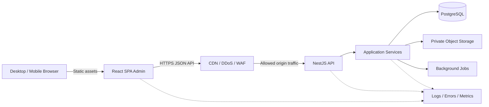
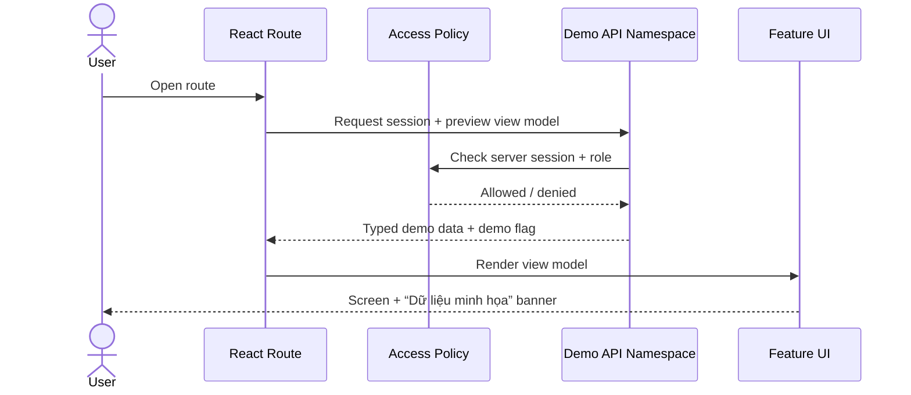
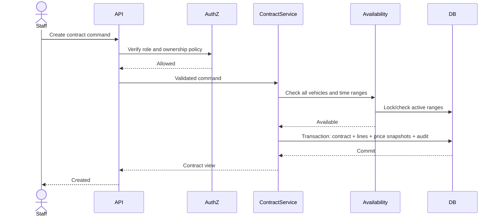

# System Architecture — Hệ thống quản lý cho thuê xe máy

**Version:** 0.6
**Last Updated:** 2026-09-01  
**Architect:** CTO  
**Status:** APPROVED BASELINE; Sprint 2–3 implementation reconciled

## 1. High-Level Architecture



Backend là NestJS modular monolith; React SPA và API deploy độc lập trong cùng workspace. Typed contracts giữ frontend/backend đồng bộ. Landing page tương lai là app riêng và không buộc admin dùng SSR.

## 2. Layer Breakdown

```text
Presentation      React routes, pages, components, view models
API adapters      NestJS controllers, guards, pipes, interceptors, filters
        ↓
Application       Use cases, commands, queries, authorization policies
        ↓
Domain            Entities, value objects, state machines, invariants
        ↓
Infrastructure    Prisma repositories, sessions, storage, PDF, logging
```

Dependencies hướng vào domain/application. Component không chứa quy tắc tính giá, availability hoặc finance.

## 3. Domain Modules

| Module | Responsibility |
|---|---|
| identity | User, employee, role, permission, session |
| dashboard | Operational read model for today |
| fleet | Vehicle, type, status, availability, images |
| customers | Customer, contacts, documents, tags, blacklist |
| pricing | Price tiers, late fee, override policy |
| contracts | Contract aggregate, vehicle lines, lifecycle |
| returns | Partial return, inspections, settlement |
| finance | Payments, allocations, refunds, receivables |
| reporting | Revenue, debt, employee reports, export |
| settings | Business profile and editable catalogs |
| audit | Append-only sensitive action log |

## 4. Sprint 1 Data Flow



Sprint 1 demo API là adapter tạm, chỉ mount khi `DEMO_MODE` bật rõ ràng ở development/staging. Production không bao giờ mount demo namespace; cấu hình bật demo trong production phải làm startup/deploy thất bại. Các sprint sau thay handlers bằng application query/repository mà giữ response contract ổn định.

## 5. Core Production Data Flow — Contract Creation



## 6. File Blueprint — Sprint 1

> The tree below is the Gate 1 capability map. The authoritative source-file list is
> `.project/documentation/file-blueprint-sprint-1.md`, reconciled and approved by CTO on
> 2026-09-01 after code review. Where individual paths differ, the exact file contract wins.

```text
app/
├── package.json                               # Workspace scripts and shared tooling
├── pnpm-workspace.yaml                        # Admin, API and packages workspace map
├── pnpm-lock.yaml                             # Reproducible dependency graph
├── tsconfig.base.json                         # Shared strict TypeScript configuration
├── eslint.config.mjs                          # Lint and module-boundary rules
├── playwright.config.ts                       # Cross-app desktop/mobile E2E projects
├── .env.example                               # Documented non-secret environment keys
├── apps/
│   ├── admin/
│   │   ├── index.html                         # React SPA document shell
│   │   ├── package.json                       # Admin-only dependencies and scripts
│   │   ├── vite.config.ts                     # Vite build, aliases and dev proxy
│   │   ├── vitest.config.ts                   # Frontend unit test configuration
│   │   └── src/
│   │       ├── main.tsx                       # React root bootstrap
│   │       ├── app/App.tsx                    # Providers and router host
│   │       ├── app/router.tsx                 # Role-aware route definitions
│   │       ├── app/styles.css                 # Approved design tokens and globals
│   │       ├── pages/LoginPage.tsx            # Login route composition
│   │       ├── pages/DashboardPage.tsx        # Operations dashboard route
│   │       ├── pages/VehiclesPage.tsx         # Vehicle preview route
│   │       ├── pages/CustomersPage.tsx        # Customer preview route
│   │       ├── pages/ContractsPage.tsx        # Contract preview route
│   │       ├── pages/ReturnsPage.tsx          # Return operations preview route
│   │       ├── pages/ReportsPage.tsx          # Owner-only report preview route
│   │       ├── pages/EmployeesPage.tsx        # Owner-only employee preview route
│   │       ├── pages/SettingsPage.tsx         # Owner-only settings preview route
│   │       ├── pages/AccessDeniedPage.tsx     # Forbidden-state route
│   │       ├── features/auth/                 # FE #1 login, session query and route guard UI
│   │       ├── features/dashboard/            # FE #2 dashboard components and view model
│   │       ├── features/fleet/                # FE #2 vehicle preview feature
│   │       ├── features/customers/            # FE #2 customer preview feature
│   │       ├── features/contracts/            # FE #2 contract preview feature
│   │       ├── features/returns/              # FE #2 return board preview feature
│   │       ├── features/reporting/            # FE #2 owner report preview feature
│   │       ├── features/employees/            # FE #1 owner employee preview feature
│   │       ├── features/settings/             # FE #1 owner settings preview feature
│   │       └── shared/
│   │           ├── ui/AppShell.tsx            # FE #1 desktop/mobile navigation shell
│   │           ├── ui/DemoBanner.tsx          # FE #1 persistent demo indicator
│   │           ├── ui/PageHeader.tsx          # FE #1 shared title/actions pattern
│   │           ├── ui/StatusBadge.tsx         # FE #1 semantic status component
│   │           ├── ui/DataTable.tsx           # FE #1 accessible responsive table
│   │           ├── ui/ViewState.tsx           # FE #1 loading/empty/error pattern
│   │           ├── api/client.ts              # Fetch credentials/error policy wrapper
│   │           ├── api/generated/             # Orval-generated types, calls and Query hooks
│   │           ├── i18n/dictionaries.ts       # Vietnamese/English dictionaries
│   │           ├── i18n/locale.ts             # Locale state and persistence
│   │           └── navigation/routes.ts       # Role-aware navigation model
│   ├── api/
│   │   ├── package.json                       # API-only dependencies and scripts
│   │   ├── vitest.config.ts                   # Backend test configuration
│   │   └── src/
│   │       ├── main.ts                        # BE #1 Nest bootstrap, Helmet/CORS/pipes/shutdown
│   │       ├── app.module.ts                  # BE #1 root module composition
│   │       ├── config/                        # BE #1 validated environment/security config
│   │       ├── common/guards/                 # BE #1 auth/throttle base guards
│   │       ├── common/pipes/                  # BE #1 validation and boundary transforms
│   │       ├── common/interceptors/           # BE #1 request context and safe logging
│   │       ├── common/filters/                # BE #1 normalized API errors
│   │       ├── modules/auth/                  # BE #2 login, logout, session and RBAC policies
│   │       ├── modules/demo/                  # BE #2 guarded Sprint 1 preview endpoints
│   │       ├── modules/health/                # BE #1 health/readiness endpoints
│   │       └── shared/                        # Backend-only application abstractions
│   └── landing/                               # FUTURE: separate prerendered marketing site
│       └── README.md                          # Landing scope/SEO decision placeholder only
├── packages/
│   ├── api-client/
│   │   ├── openapi.json                       # Generated NestJS API contract for CI diff
│   │   └── orval.config.ts                    # Typed fetch/Query client generation
│   ├── database/
│   │   ├── prisma/schema.prisma               # BE #2 user, employee and session schema
│   │   ├── prisma/seed.ts                     # BE #2 owner/staff and demo seed
│   │   └── src/client.ts                      # BE #2 Prisma client lifecycle
│   └── test-utils/
│       └── src/index.ts                       # Shared builders and test helpers
├── tests/
│   ├── api/auth-policy.test.ts                # Role, lock and session integration tests
│   ├── admin/navigation.test.tsx              # Role navigation frontend tests
│   └── contracts/openapi-contract.test.ts     # OpenAPI/client generation contract tests
└── e2e/
    ├── login.spec.ts                          # Login and locked-account journeys
    ├── workspace-navigation.spec.ts           # Owner/staff route access journeys
    └── responsive-preview.spec.ts             # Desktop/mobile UI acceptance journey
```

### 6.1 Exact Sprint 1 source-file contract

The complete per-file blueprint is maintained in
`.project/documentation/file-blueprint-sprint-1.md`. It is part of this architecture
contract: new Sprint 1 files require a CTO update there before implementation.

### 6.2 Exact Sprint 2–3 source-file contract

The planned fleet, customer, pricing and contract files are defined in
`.project/documentation/file-blueprint-sprint-2-3.md`. This extension preserves the
modular-monolith dependency direction above and becomes authoritative after the Product
Owner approves the Sprint 2–3 BDD scenarios and expanded wireframes.

The same blueprint includes the approved Sprint 3 follow-up for configurable late-return
fees: versioned pricing owns configuration, each contract vehicle line owns an immutable
snapshot, and the Owner-only Settings page publishes new versions.
## 7. Import Boundary Rules

- Admin pages import only public `features/*/index.ts` and `shared/*`.
- Features may import `shared/*` but not another feature’s internals.
- Backend domain/application code cannot import React, NestJS adapter or Prisma types.
- NestJS owns runtime DTO validation and OpenAPI; frontend consumes the generated `packages/api-client` contract, never backend internals.
- Demo routes are mounted only in development/staging under explicit demo configuration. Production never mounts the namespace; `DEMO_MODE=true` in production fails startup/deployment validation.
- New file requires blueprint update before implementation.

## 8. Naming Conventions

| Element | Convention | Example |
|---|---|---|
| Components | PascalCase noun | `OperationsDashboard.tsx` |
| Hooks/functions | camelCase, hook uses `use` | `useLocale` |
| Domain utilities | kebab-case file | `availability-policy.ts` |
| Types | PascalCase noun | `ContractPreview` |
| Unit tests | `{source}.test.ts` | `access-policy.test.ts` |
| E2E | `{journey}.spec.ts` | `responsive-preview.spec.ts` |
| Constants | UPPER_SNAKE_CASE | `SESSION_MAX_AGE` |

## 9. Security Architecture

- HTTPS production and secure headers/CSP.
- Server-side session and authorization policies.
- Explicit allowed-origin CORS and credential configuration between SPA and API.
- CSRF protection for cookie-authenticated mutations.
- NestJS global `ValidationPipe` validates backend DTO trust boundaries; Zod validates frontend forms.
- Prisma parameterized queries; raw SQL only after security review.
- Private object storage and signed URLs.
- Append-only audit for sensitive mutations.
- Rate limit login and sensitive endpoints.
- Edge DDoS/WAF protection and direct-origin blocking are production requirements.
- Detailed controls and tests live in `.project/documentation/security.md`.
- No PII/payment data in logs or client demo bundles.

## 10. Scalability Strategy

MVP uses a static React admin, NestJS API instances and managed PostgreSQL. Admin and API scale/deploy independently. Queue and read replicas are deferred until measurements justify them. Multiple API replicas require shared abuse/session coordination; database indexes target active contract ranges, plate numbers, customer contacts and report date filters.

## 11. Monitoring and Observability

- Structured request/application logs with correlation ID.
- Error tracking for frontend and server.
- Health endpoint and uptime monitoring.
- Metrics: p95 response, error rate, failed login, active rentals, overdue count, backup status.
- Alert on backup failure and repeated production errors.

## 12. Architecture Gate

**APPROVED BASELINE — GATE 1 (2026-08-31).** Sprint 1 is complete. Sprint 2–3 blueprint,
BDD and wireframe extensions were approved on 2026-09-01. The exact Sprint 2 implementation
paths were reconciled in `file-blueprint-sprint-2-3.md` after code review.
