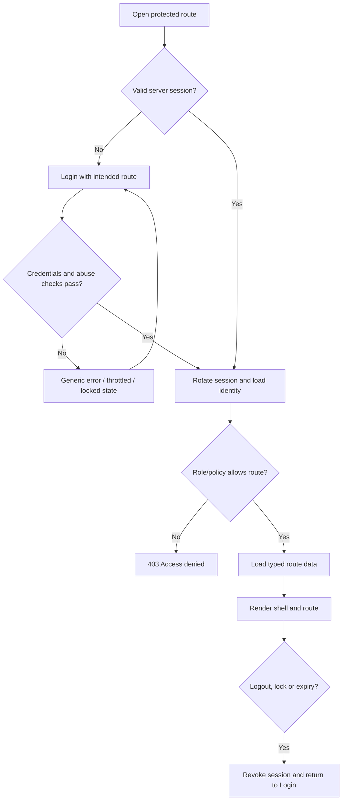

# Flow — Authentication and Role Access

## Acceptance notes

- Login responses do not disclose whether the user exists.
- Owner sees all Sprint 1 routes; Staff does not see or access reports/employees/settings.
- A locked staff fixture loses access even if a previous client state still shows navigation.
- Successful authentication returns only to a safe internal intended route.
