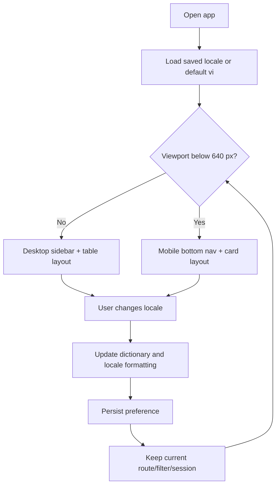

# Flow — Locale and Responsive Navigation

## Acceptance notes

- Resizing does not lose route, filter or session state.
- Tables become cards without dropping critical identifier, status, deadline or primary action.
- Locale switching changes UI copy/date/currency only, never business data.
- 360 px viewport has no page-level horizontal overflow.
