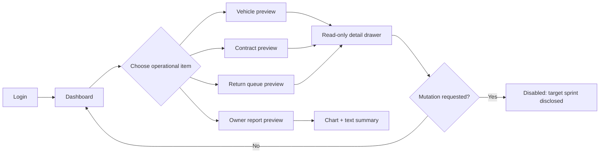

# Flow — Sprint 1 Operations Preview

## Acceptance notes

- Demo banner stays visible across every preview.
- Overdue and due-soon items appear before neutral operational items.
- No preview mutation pretends to persist data.
- Dashboard, list and detail use consistent status language.
